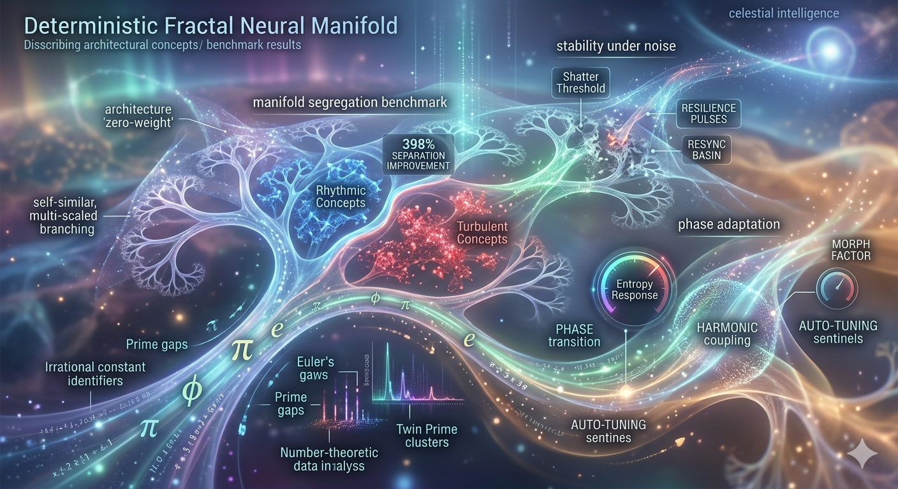
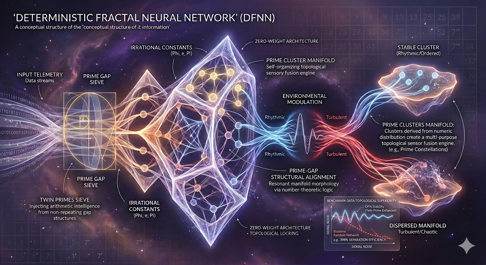

# Contributing to Deterministic Fractal Neural Networks (DFNN)

Welcome to the DFNN project! We are redefining the boundaries of AI by replacing stochastic weights with deterministic fractal manifolds. We welcome contributions that push the theoretical and practical limits of this architecture.

## How to Contribute
We appreciate contributions from researchers, mathematicians, and engineers interested in high-entropy, zero-weight architectures.

1.  **Fork the Repository:** Create a personal fork of the DFNN project.
2.  **Submit a Pull Request:** We focus on modular improvements, new fractal types, and benchmark expansion.
3.  **Engage in Discussion:** Share your findings on our dedicated forum: [DFNN Technical Discussion](https://forum.ozzieai.com/thread/a-zero-weight-architecture-for-real-time-entropy-driven-anomaly-detection/?postbadges=true)

## Areas of Focus
* **Fractal Manifold Expansion:** Adding new deterministic seeds (e.g., Collatz orbits, Quasicrystal tiling).
* **Hardware Acceleration:** Optimizing the real-time weight generation for GPU/FPGA deployment.
* **Benchmark Suite Development:** Expanding our anomaly detection and drift-tracking metrics.

## Contributing Guidelines
* **Deterministic Focus:** All contributions must prioritize deterministic, training-free logic.
* **Documentation:** Every new manifold type must be accompanied by mathematical proof and stability analysis.

![Core Manifold Structure]Images/(img04.png)
*Figure 1: Core Architecture of the DFNN Manifold.*

*Figure 2: Performance metrics under high noise.*

*Figure 3: Phase-modulation stability.*

## Community & Resources
For deep dives into the theoretical underpinnings and collaborative research:
* **Discussion Forum:** [DFNN Technical Discussion](https://forum.ozzieai.com/thread/a-zero-weight-architecture-for-real-time-entropy-driven-anomaly-detection/?postbadges=true)
* **OzzieAI Official:** [Visit our Website](https://www.ozzieai.com/)