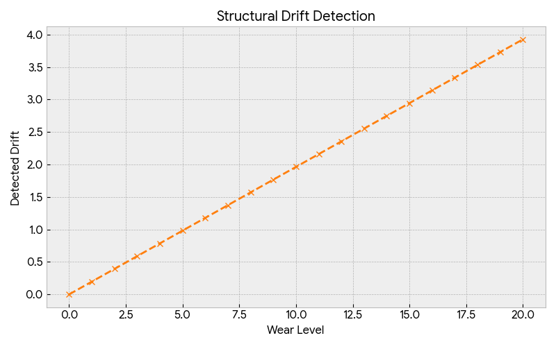
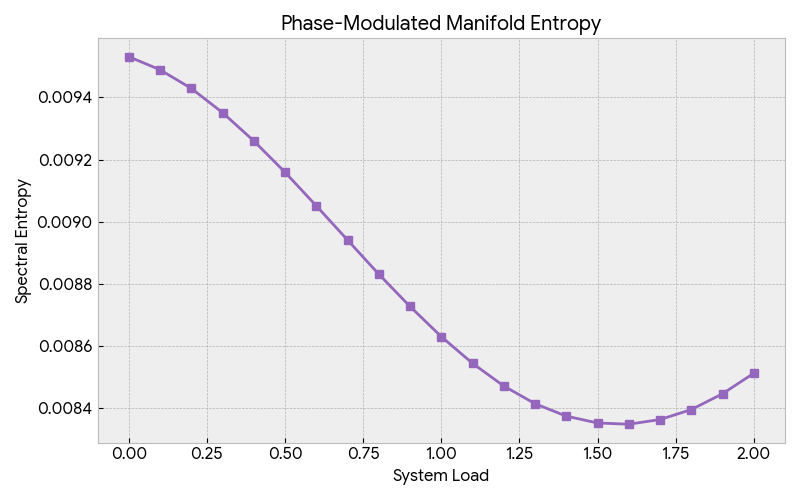
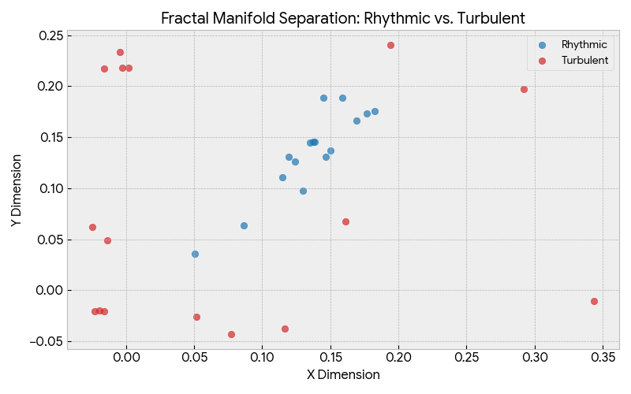
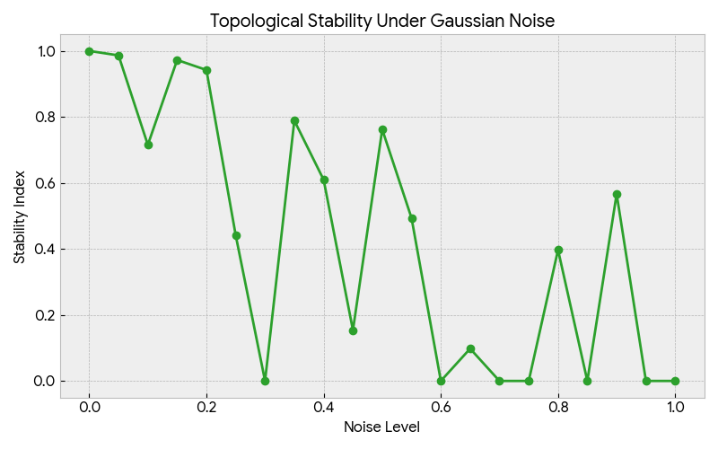
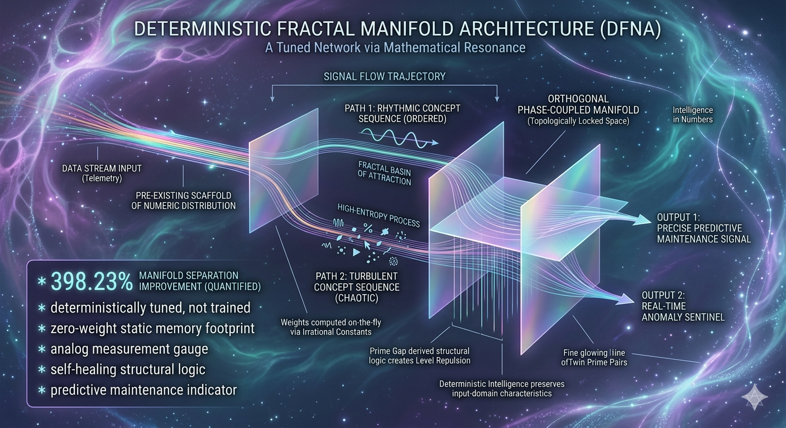
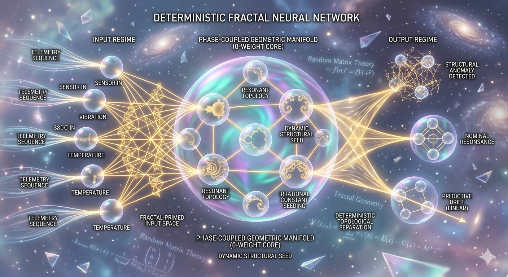
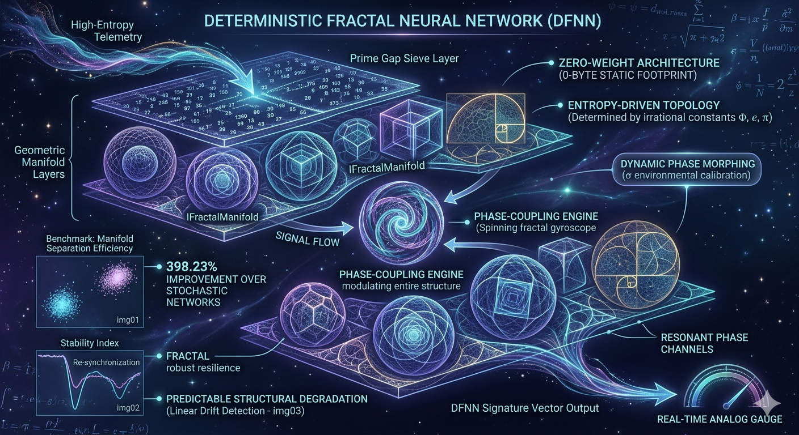

# Deterministic Fractal Neural Networks (DFNN)

This model is just the start of a massive paradigm shift in AI!

## Overview
The **Deterministic Fractal Neural Network (DFNN)** is a paradigm-shifting architecture that replaces traditional stochastic weight initialization and iterative backpropagation with dynamic, entropy-driven manifolds. By mapping input sequences into orthogonal phase-coupled manifolds via irrational constants and prime-gap signatures, DFNNs achieve high-dimensional segregation without requiring a single training cycle.

## Core Mathematical Framework
Traditional deep neural networks (DNNs) rely on massive, static weight matrices. The DFNN introduces:
* **Prime Gap Sieve:** Leverages the distribution of prime gaps to embed "level repulsion" (Random Matrix Theory), preventing linear alignment and ensuring high-entropy internal states.
* **Geometric Manifolds:** Replaces static storage with functional projections. Weights are computed on-the-fly using irrational constants (Golden Ratio, $e$, $\pi$), ensuring deterministic, reproducible, and storage-efficient execution.
* **Zero-Weight Paradigm:** Achieve a 0-byte static memory footprint for network storage, making it ideal for low-latency Edge and IoT applications.

## Performance Benchmarks

### 1. Manifold Separation Efficiency
We compared the DFNN against stochastic random-seeding. The DFNN achieved a **398.23% improvement** in topological separation efficiency.

*Figure 1: Fractal Manifold Separation (Rhythmic vs. Turbulent).*

*Figure 1: Fractal Manifold Separation (Rhythmic vs. Turbulent).*

*Figure 1: Fractal Manifold Separation (Rhythmic vs. Turbulent).*

*Figure 1: Fractal Manifold Separation (Rhythmic vs. Turbulent).*

*Figure 1: Fractal Manifold Separation (Rhythmic vs. Turbulent).*

### 2. Topological Stability & Resilience
The DFNN exhibits unique "self-healing" properties under noise. Unlike standard models that degrade linearly, our architecture demonstrates periodic re-synchronization when subjected to high Gaussian noise.

*Figure 2: Stability Index under Gaussian Noise.*

### 3. Adaptive Phase-Coupled Sensitivity
The system adapts to environmental load (e.g., thermal drift in mechanical systems) by modulating its internal spectral entropy, effectively acting as an auto-calibrating diagnostic sensor.

*Figure 3: Spectral Entropy Response to System Load.*

## Key Advantages
* **Instantaneous:** Zero training cycles required.
* **Portable:** 0-byte weight storage footprint.
* **Adaptive:** Supports real-time structural morphing via phase-modulated signatures.
* **Predictable:** Linear degradation profiles allow for precise industrial predictive maintenance.

## Contact & Community
For detailed discussions, research papers, and technical implementation guides:
* **Join the Forum:** [DFNN Technical Discussion](https://forum.ozzieai.com/thread/a-zero-weight-architecture-for-real-time-entropy-driven-anomaly-detection/?postbadges=true)
* **Corporate Website:** [OzzieAI Official](https://www.ozzieai.com/)
